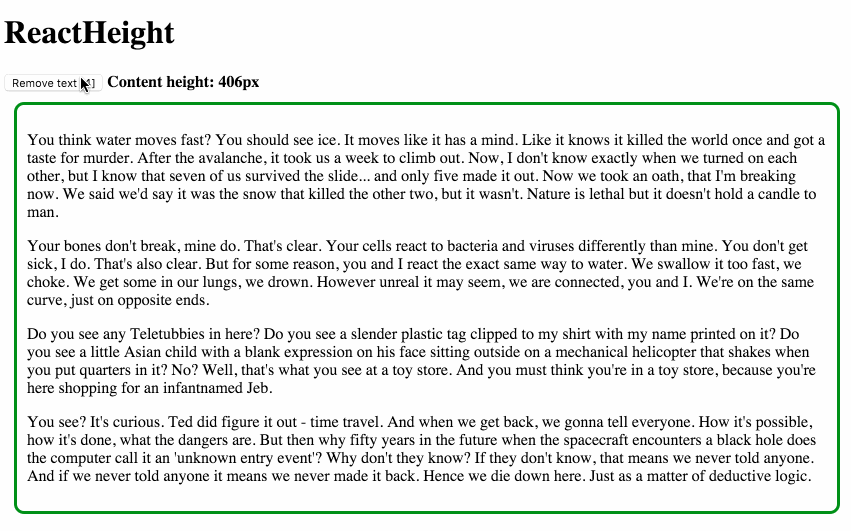

# react-height [](https://www.npmjs.com/package/react-height)

[](https://gitter.im/nkbt/help)

[](https://circleci.com/gh/nkbt/react-height)
[](https://ci.appveyor.com/project/nkbt/react-height)
[](https://codecov.io/github/nkbt/react-height?branch=master)
[](https://david-dm.org/nkbt/react-height)
[](https://david-dm.org/nkbt/react-height#info=devDependencies)

Component-wrapper to determine and report children elements height





## Installation

### NPM

```sh
npm install --save react react-height
```

Don't forget to manually install peer dependencies (`react`) if you use npm@3.


### Bower:
```sh
bower install --save https://unpkg.com/react-height/bower.zip
```

or in `bower.json`

```json
{
  "dependencies": {
    "react-height": "https://unpkg.com/react-height/bower.zip"
  }
}
```

then include as
```html
<script src="bower_components/react/react.js"></script>
<script src="bower_components/react-height/build/react-height.js"></script>
```


### 1998 Script Tag:
```html
<script src="https://unpkg.com/react/dist/react.js"></script>
<script src="https://unpkg.com/react-height/build/react-height.js"></script>
(Module exposed as `ReactHeight`)
```


## Demo

[http://nkbt.github.io/react-height/example](http://nkbt.github.io/react-height/example)

## Codepen demo

[http://codepen.io/nkbt/pen/NGzgGb](http://codepen.io/nkbt/pen/NGzgGb?editors=101)

## Usage
```js
<ReactHeight onHeightReady={height => console.log(height)}>
  <div>Random content</div>
</ReactHeight>
```

## Options


#### `onHeightReady`: PropTypes.func.isRequired

Callback, invoked when height is measured (and when it is changed).

#### `getElementHeight`: PropTypes.func

Function to measure your element. It receives the element as argument and defaults to `el => el.clientHeight`.

#### `children`: PropTypes.node.isRequired

One or multiple children with static, variable or dynamic height.

```js
<ReactHeight onHeightReady={height => console.log(height)}>
  <p>Paragraph of text</p>
  <p>Another paragraph is also OK</p>
  <p>Images and any other content are ok too</p>
  
</ReactHeight>
```


#### `hidden`: PropTypes.bool (default: false)

ReactHeight can render to null as soon as height is measured.

```js
<ReactHeight hidden={true} onHeightReady={height => console.log(height)}>
  <div>Will be removed from the DOM when height is measured</div>
</ReactHeight>
```

#### Pass-through props

All other props are applied to a container that is being measured. So it is possible to pass `style` or `className`, for example.

```js
<ReactHeight onHeightReady={height => console.log(height)}
  style={{width: 200, border: '1px solid red'}}
  className="myComponent">

  <div>
    Wrapper around this element will have red border, 200px width
    and `class="myComponent"`
  </div>
</ReactHeight>
```


## Development and testing

Currently is being developed and tested with the latest stable `Node 5` on `OSX` and `Windows`.
Should be ok with Node 4, but not guaranteed.

To run example covering all `ReactHeight` features, use `npm start`, which will compile `src/example/Example.js`

```bash
git clone git@github.com:nkbt/react-height.git
cd react-height
npm install
npm start

# then
open http://localhost:8080
```

## Tests

```bash
npm test

# to run tests in watch mode for development
npm run test:dev

# to generate test coverage (./reports/coverage)
npm run test:cov
```

## License

MIT
